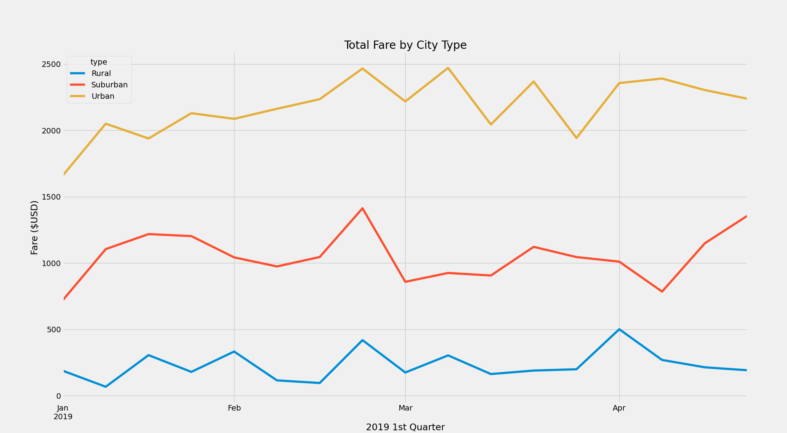

# PyBer_Analysis

## Overview of Project
     
The purpose of this analysis was to create a dataset that plot the client's rideshare buisness for different city types and to pin point 
key data points that can used to increase buisness profits.      
 
## Results

The data was focused on the 1st quarter of 2019 and it shows that urban city fares are making triple amount of fares compared to rural areas.
Also, every city type seems to have a significant amount of buisness fares at the end of Febuary. See Chart below for refrence: 

## Summary
       
After completing this analysis, there are three things I would recommend the CEO to do to raise profits. Firest, with urban city types clearly on top for profit,
I would suggest more employees to work the urban areas since you could possibly gain even more profit. Second, this goes along with helping the 1st suggestion, 
start moving rural drivers to city areas since the profits are close to 0. Basically you are almost losing money in these areas. My third suggesetion would effect suburban and rural areas. I would suggest raising the fares of these areas since the demand isn't as high for urban areas. That way, less drivers working these areas will get more for their buck by having only 5 customers for the day as oppose to a city driver with 20 drives a day.     
